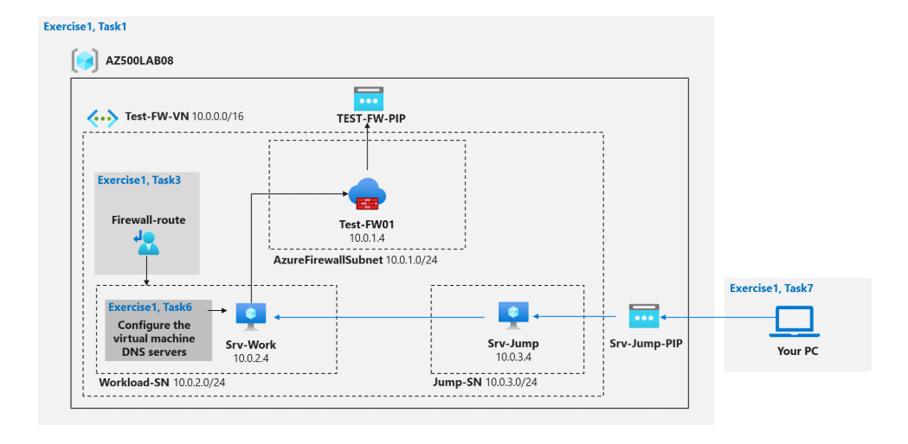

# Configuring Azure Firewall for Secure Network Traffic Management

## Overview
This project demonstrates the configuration of Azure Firewall to control inbound and outbound traffic, enhancing network security. The setup involves creating a secure network architecture with custom routing and firewall rules.

## Azure Firewall Diagram Architecture

## Deployment

1. **Create a Virtual Network**: Set up a virtual network with two subnets (Workload Subnet and Jump Host Subnet).  
2. **Deploy Virtual Machines**: Add a virtual machine to each subnet for testing.  
3. **Deploy Azure Firewall**: Place the firewall in a dedicated `AzureFirewallSubnet` within the virtual network.  
4. **Configure Custom Routes**: Add a route table to the Workload Subnet to route all outbound traffic through the firewall.  
5. **Set Firewall Rules**:  
   - Add an **Application Rule** to allow access only to `www.bing.com`.  
   - Add a **Network Rule** to allow DNS server lookups on port 53.  
6. **Test Traffic**: Verify that only authorized traffic is allowed and DNS resolution works as expected.  
