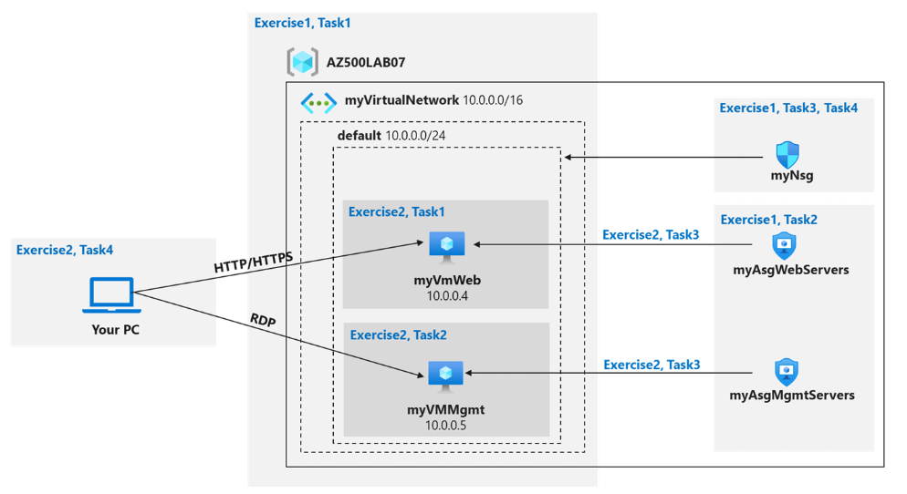

# Virtual Network Security: Implementation with NSGs and ASGs

## Overview
This project demonstrates the implementation of secure virtual networking using **Network Security Groups (NSGs)** and **Application Security Groups (ASGs)** in Azure. It highlights best practices for planning and implementing security within virtual networks, focusing on efficient access control and resource segmentation.

## Key Concepts
- **Network Security Groups (NSGs):** Define and enforce inbound and outbound traffic rules at the subnet and virtual machine (VM) level.
- **Application Security Groups (ASGs):** Group VMs for logical management and simplified application of NSG rules.

## Project Goals
- Showcase practical implementation of virtual network security.
- Highlight the use of NSGs and ASGs to enforce precise traffic control policies.
- Demonstrate advanced Azure networking skills for personal projects and portfolios.

## Diagram

# Deployment steps:

#### 1. Create Virtual Network (VNet)
- Define a VNet with two subnets: Web Servers Subnet and Management Servers Subnet.

#### 2. Create Application Security Groups (ASGs)
- Create Web Servers ASG and Management Servers ASG.

#### 3. Deploy Virtual Machines
- Deploy web and management servers in their respective subnets. Ensure web servers run IIS, and management servers allow RDP access.

#### 4. Create Network Security Groups (NSGs)
- Web Servers NSG: Allow inbound HTTP (port 80) traffic.
- Management Servers NSG: Allow RDP (port 3389) from trusted sources.

#### 5. Apply NSGs to Subnets
- Attach the appropriate NSGs to each subnet.

#### 6. Test Connectivity
- Verify web servers show the IIS page (HTTP).
- Test RDP access to management servers from trusted IPs only.
